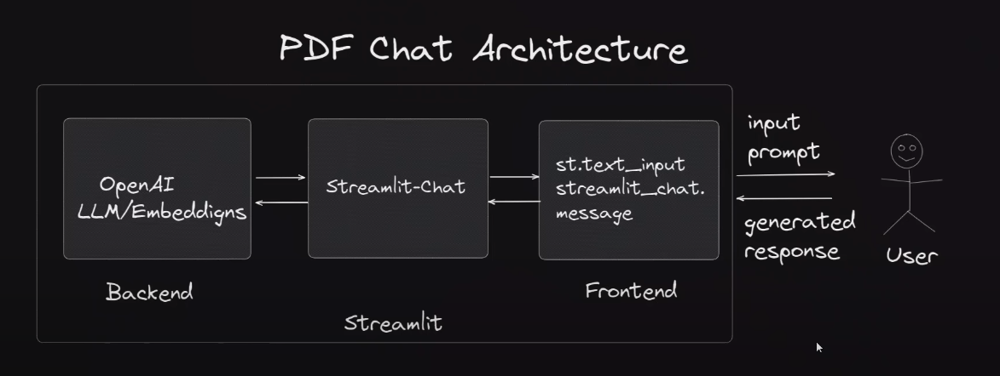
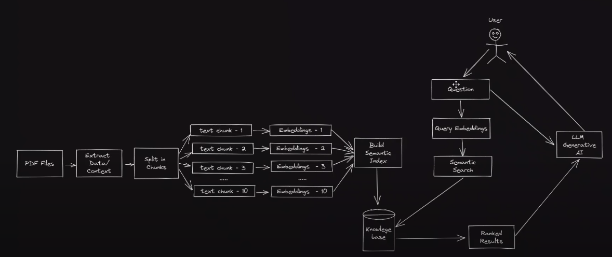

# Chat-with-multiple-docs-VarunSoni

## Project Abstract in visuals 

## **LangChain: Streamlining LLM Application Development**

LangChain is an open-source framework designed to simplify the development of applications powered by Large Language Models (LLMs). It acts as a generic interface, allowing you to seamlessly integrate various LLMs into your workflows.

### Abstraction for Efficiency:

LangChain's core strength lies in its abstraction layer. It provides pre-built components representing common tasks in LLM interaction. These components can be chained together to create complex Natural Language Processing (NLP) pipelines. This modular approach significantly reduces development time and boilerplate code compared to building everything from scratch.

### Prompt Engineering Made Easy:

LangChain offers a prompt template class for crafting effective prompts for your LLM. These templates eliminate the need for manual context and query encoding. You can define specific instructions like avoiding technical jargon, including guiding examples, or even specifying the desired output format.

### Chaining the Workflow:

Chains are the backbone of LangChain applications. They orchestrate the interaction between LLMs and other components. Imagine a sequence of functions working together. In a chain, the output from one function (e.g., data retrieval) becomes the input for the next (e.g., summarization). Each function within a chain can leverage distinct prompts, parameters, and even different LLM models based on the specific task at hand.

### External Data Integration:

LLMs may require access to information beyond their training data. LangChain addresses this through indexes, which act as external data sources. The Document Loader index facilitates importing data from various sources like file storage services. LangChain also supports integration with vector databases and text splitters for advanced NLP tasks.

### Decision-Making Agents (Optional):

While not always necessary, LangChain can incorporate agents that act as reasoning engines within your application. These agents dynamically determine the next course of action based on the available information and the overall workflow logic.

## Applications of LangChain:

LangChain's versatility allows it to be used in various NLP applications, including:

1. **Enhanced Chatbots** : LangChain can provide context for chatbots, integrate them with existing communication channels, and leverage APIs for a more streamlined user experience.
2. **Efficient Summarization** : Build applications that extract key points from lengthy documents or articles using LLM capabilities.
3. **Accurate Question Answering** : Develop systems that can search for and deliver clear answers to user queries.
4. **Data Augmentation** : Generate new training data for your LLMs based on existing information, leading to improved performance.
5. **Intelligent Virtual Assistants** : Create virtual assistants capable of answering questions, searching for information, and even completing tasks online.

By leveraging LangChain's functionalities, you can significantly streamline the development of powerful LLM applications and unlock the full potential of these advanced language models.